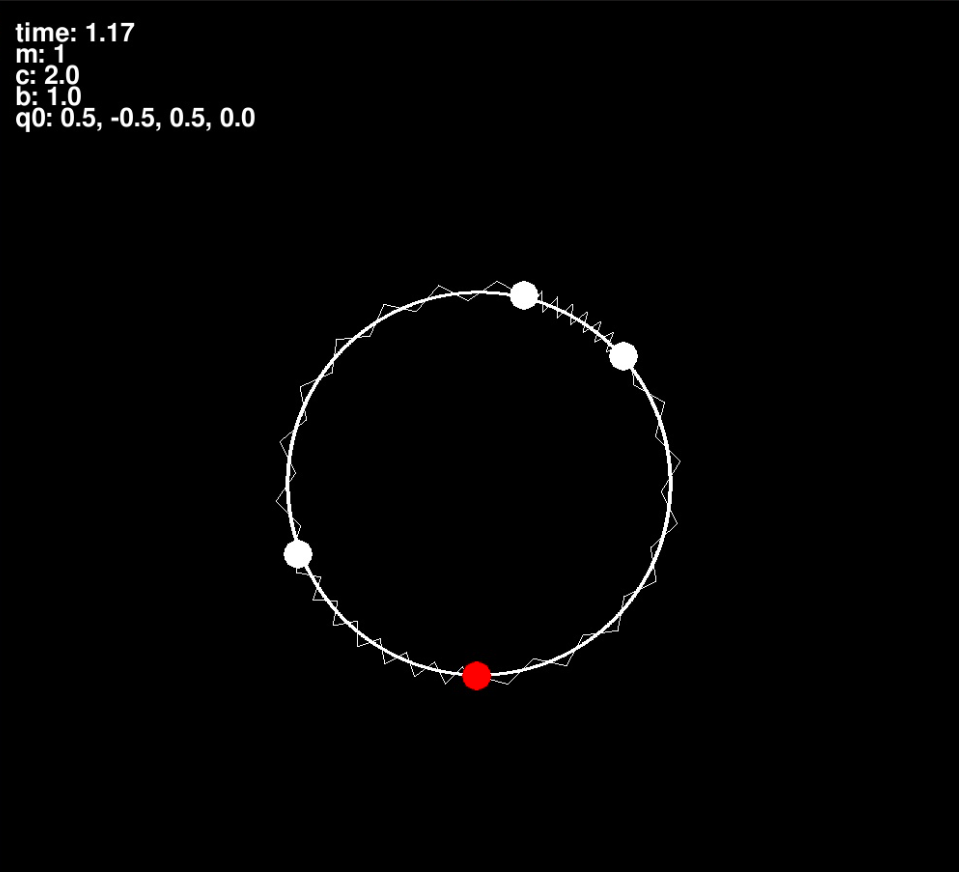
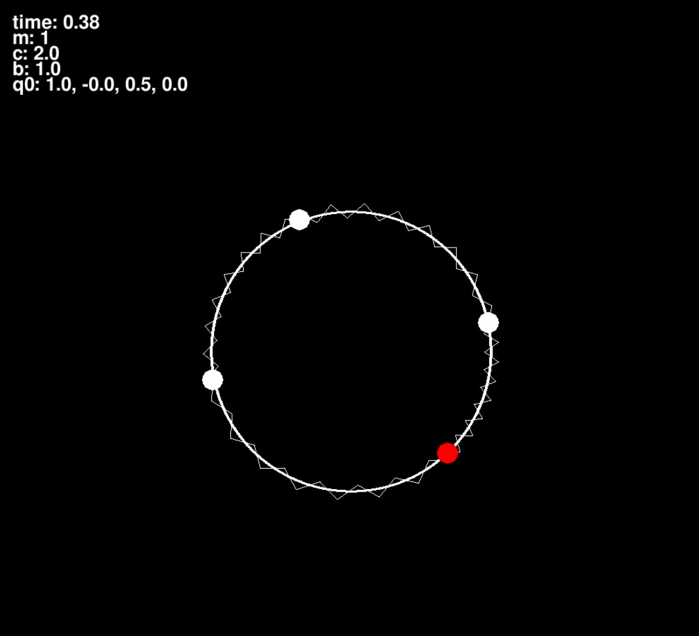

## Условие задачи


## Решение
Сначала я записал потенциальную и кинетическую энергию системы в зависимости от угла. После этого я составил Лагранжиан системы и решил его. Подробности по решению можно посмотреть в папке `theory`. Этот файл есть и на [google drive](https://drive.google.com/file/d/1ojQrnrNMsLKF_fzb_XrYv6zhg_2H0U2E/view?usp=sharing)

## Реализация
Для реализации я решил использовать язык `python` и библиотеки:
- `numpy` - хранение координат
- `scipy` - решения уравнений
- `pygame` - отображение

## Запуск

Для запуска скачайте репозиторий, затем 
```bash
git clone https://github.com/sevashasla/analytical_mechanics_4sem
```
После этого скачайте необходимые файлы из `dependencies.txt`
```bash
pip install dependencies.txt
```
В данном задаче решение сильно зависит от параметров. Их список можно посмотреть. Для этого перейдите в директорию `scripts` и выполните
```
python3 run.py -h
```

После этого можно запустить само моделирование
```
python3 run.py -b=1 -c=2 --q0 0.5 -0.5 0.5 0.0
```
Далее откроется окно с моделированием процесса. В окне можно наблюдать параметрами, с которыми мы запустили систему. И ещё время, которое прошло в системе.





## Анализ
Результаты можно посмотреть в папке `experiments`


